# GR-K-GDSS Test Results

This document records snapshot results from the gr-k-gdss test suite. For how to run the tests and what they do, see [TESTING.md](TESTING.md).

**Last recorded run: 18 April 2026**

- **pytest:** 106 passed, 1 skipped, 2 xpassed (109 collected, installed `kgdss` module). `TestT3KeyringRoundTrip::test_keyring_round_trip` is skipped when no keyring is available (expected in many environments).
- **ITU channel-model regression suite:** 42 passed (`tests/test_t2_channel_models.py`, included in pytest total). Covers P.1238 indoor and M.1225 Pedestrian/Vehicular profiles with deterministic NumPy channel emulation.
- **T4 counter-overflow/re-key recovery:** 2 passed (`tests/test_t4_counter_overflow.py`).
- **T5 Pedestrian-B strict timing capability:** 11 passed, 2 xpassed (`tests/test_t5_pedestrian_b_timing.py`). The previous 13 xfail markers were retired after the despreader gained matched-filter despreading, decision-directed channel equalization, and an MF-power peak-tracking timing loop (opt-in via `set_channel_equalization(True)`).
- **C++ crypto tests (optional):** 2 passed with **`KGDSS_ENABLE_CRYPTO_TESTS=ON`** (`kgdss_test_chacha_keystream`, `kgdss_test_spreader_stats`) under `ctest -R 'kgdss_test_'`. See [TESTING.md](TESTING.md#c-crypto-tests-optional).
- **IQ file analysis:** 29 passed, 0 failed, 0 warnings (unchanged methodology). Cross-session: Standard GDSS 1.0000 (VULNERABLE), Keyed GDSS 0.1028 (PROTECTED), 9.7x reduction. Plots: `tests/iq_files/iq_comparison.png`, `tests/iq_files/iq_comparison_vs_standard.png`; spectrum snapshots (600 kHz): `tests/iq_files/spectrum_baseline.png`, `tests/iq_files/spectrum_realistic_baseline.png`, `tests/iq_files/spectrum_standard_gdss.png`, `tests/iq_files/spectrum_keyed_gdss.png`, `tests/iq_files/spectrum_real_noise.png`, `tests/iq_files/spectrum_realistic_plus_standard_gdss.png`, `tests/iq_files/spectrum_realistic_plus_keyed_gdss.png`.
- **Preprint BER / channel simulations (not pytest):** Statistical Monte Carlo figures for [Section 7](https://github.com/Supermagnum/GR-K-GDSS/blob/main/paper/kgdss_paper.tex) live under `paper/figures/` (`fig7_awgn_ber.png` through `fig10_ldpc.png`). Regenerate via [paper/README.md](../paper/README.md) (`ber_simulation.py`, `gen_figures.py`). See [Preprint BER and ITU/STANAG-style channel figures](#preprint-ber-and-itustanag-style-channel-figures) below.

---

## Table of Contents

- [Unit tests (pytest)](#unit-tests-pytest)
- [Round trip (what it means)](#round-trip-what-it-means)
- [IQ test file generation](#iq-test-file-generation)
- [IQ file analysis](#iq-file-analysis)
  - [Explanation of analysis tests](#explanation-of-analysis-tests)
  - [IQ comparison plots](#iq-comparison-plots)
  - [Spectrum snapshot plots](#spectrum-snapshot-plots)
  - [Real recorded noise (File 08): interpretation](#real-recorded-noise-file-08-interpretation)
- [Preprint BER and ITU/STANAG-style channel figures](#preprint-ber-and-itustanag-style-channel-figures)

---

## Round trip (what it means)

Several tests and IQ checks are described as **round trip** in logs and tables. In GR-K-GDSS that means **forward + inverse** (or **store + load**) with a consistency check—not necessarily a literal antenna-to-antenna link.

- **pytest (T1, cross-layer):** spread then despread with the same key/nonce in software; same *idea* as TX then RX on the keyed GDSS blocks, **without** RF or channel unless added elsewhere.
- **pytest (T3 keyring):** store session key material in the keyring, read it back, compare bytes (**not** radio).
- **IQ analysis (File 04):** **Round-trip correlation** checks that correct-key despread output matches the payload reference (offline `.cf32` pipeline).

Full explanation: [Round trip (what it means)](TESTING.md#round-trip-what-it-means) in [TESTING.md](TESTING.md). Definition: [Round trip (testing)](GLOSSARY.md#round-trip-testing) in [GLOSSARY.md](GLOSSARY.md).

---

## Unit tests (pytest)

Run: `pytest tests/ -v` from the repository root (after installing the module and gr-linux-crypto). The **verbatim log below** is from an older capture (43 collected); the current suite has more tests. For the authoritative count, run `pytest tests/ -q` (see [TESTING.md](TESTING.md#expected-results)). Example log shape (Linux, Python 3.12):

```
============================= test session starts ==============================
platform linux -- Python 3.12.3, pytest-7.4.4, pluggy-1.4.0 -- /usr/bin/python3
cachedir: .pytest_cache
rootdir: /path/to/GR-K-GDSS
collecting ... collected 43 items

tests/test_cross_layer.py::TestCrossLayerFullStackRoundTrip::test_full_stack_round_trip PASSED [  2%]
tests/test_p372_receiver_profile.py::TestP372BaselineLoader::test_load_is_deterministic PASSED [  4%]
tests/test_p372_receiver_profile.py::TestP372ExpectedProfile::test_expected_profile_shape PASSED [  6%]
tests/test_p372_receiver_profile.py::TestP372Calibration::test_median_offset_calibration PASSED [  9%]
tests/test_t1_spreader_despreader.py::TestT1RoundTrip::test_round_trip PASSED [  5%]
tests/test_t1_spreader_despreader.py::TestT1KeystreamDeterminism::test_keystream_determinism PASSED [  7%]
tests/test_t1_spreader_despreader.py::TestT1KeySensitivity::test_key_sensitivity PASSED [ 10%]
tests/test_t1_spreader_despreader.py::TestT1WrongKeyDespreader::test_wrong_key_despreader PASSED [ 13%]
tests/test_t1_spreader_despreader.py::TestT1NonceSensitivity::test_nonce_sensitivity PASSED [ 15%]
tests/test_t1_spreader_despreader.py::TestT1InvalidKeySize::test_key_16_throws PASSED [ 18%]
tests/test_t1_spreader_despreader.py::TestT1InvalidKeySize::test_key_31_throws PASSED [ 21%]
tests/test_t1_spreader_despreader.py::TestT1InvalidKeySize::test_key_33_throws PASSED [ 23%]
tests/test_t1_spreader_despreader.py::TestT1InvalidNonceSize::test_nonce_11_throws PASSED [ 26%]
tests/test_t1_spreader_despreader.py::TestT1InvalidNonceSize::test_nonce_13_throws PASSED [ 28%]
tests/test_t1_spreader_despreader.py::TestT1GaussianDistribution::test_gaussian_distribution PASSED [ 31%]
tests/test_t1_spreader_despreader.py::TestT1NoNearZeroMask::test_no_near_zero_mask PASSED [ 34%]
tests/test_t1_spreader_despreader.py::TestT1BlockBoundaryContinuity::test_block_boundary_continuity PASSED [ 36%]
tests/test_t1_spreader_despreader.py::TestT1SetKeyMessagePort::test_round_trip_via_set_key_message PASSED [ 39%]
tests/test_t2_sync_burst.py::TestT2PNDeterminism::test_pn_determinism PASSED [ 42%]
tests/test_t2_sync_burst.py::TestT2PNKeySensitivity::test_pn_key_sensitivity PASSED [ 44%]
tests/test_t2_sync_burst.py::TestT2PNBalance::test_pn_balance PASSED     [ 47%]
tests/test_t2_sync_burst.py::TestT2TimingOffsetDeterminism::test_timing_determinism PASSED [ 50%]
tests/test_t2_sync_burst.py::TestT2TimingScheduleRange::test_schedule_range PASSED [ 53%]
tests/test_t2_sync_burst.py::TestT2TimingScheduleProperties::test_schedule_properties PASSED [ 55%]
tests/test_t2_sync_burst.py::TestT2PerBurstPNUniqueness::test_pn_backward_compatible_default PASSED [ 58%]
tests/test_t2_sync_burst.py::TestT2PerBurstPNUniqueness::test_pn_uniqueness PASSED [ 60%]
tests/test_t2_sync_burst.py::TestT2GaussianEnvelope::test_gaussian_envelope_shape PASSED [ 57%]
tests/test_t2_sync_burst.py::TestT2KeyedGaussianMask::test_mask_determinism PASSED [ 60%]
tests/test_t2_sync_burst.py::TestT2KeyedGaussianMask::test_mask_different_nonce_different_output PASSED [ 63%]
tests/test_t2_sync_burst.py::TestT2KeyedGaussianMask::test_mask_shape PASSED [ 65%]
tests/test_t2_sync_burst.py::TestT2SyncBurstNonce::test_sync_burst_nonce_length PASSED [ 68%]
tests/test_t2_sync_burst.py::TestT2SyncBurstNonce::test_sync_burst_nonce_per_session PASSED [ 71%]
tests/test_t3_key_derivation.py::TestT3OutputLength::test_output_length PASSED [ 73%]
tests/test_t3_key_derivation.py::TestT3DomainSeparation::test_domain_separation PASSED [ 76%]
tests/test_t3_key_derivation.py::TestT3Determinism::test_determinism PASSED [ 78%]
tests/test_t3_key_derivation.py::TestT3InputSensitivity::test_input_sensitivity PASSED [ 81%]
tests/test_t3_key_derivation.py::TestT3NonceConstruction::test_different_tx_seq_different_nonce PASSED [ 84%]
tests/test_t3_key_derivation.py::TestT3NonceConstruction::test_gdss_nonce_length PASSED [ 86%]
tests/test_t3_key_derivation.py::TestT3NonceConstruction::test_payload_nonce_length PASSED [ 89%]
tests/test_t3_key_derivation.py::TestT3NonceConstruction::test_session_tx_seq_collision_avoidance PASSED [ 92%]
tests/test_t3_key_derivation.py::TestT3SyncBurstNonce::test_sync_burst_nonce_distinct_from_data_nonce PASSED [ 94%]
tests/test_t3_key_derivation.py::TestT3SyncBurstNonce::test_sync_burst_nonce_length PASSED [ 97%]
tests/test_t3_key_derivation.py::TestT3KeyringRoundTrip::test_keyring_round_trip SKIPPED [100%]

======================== 42 passed, 1 skipped in 0.42s =========================
```

**Summary (historical log above):** 42 passed, 1 skipped (43 collected). With a keyring available, the keyring round-trip test may run instead of skip (43 passed, 0 skipped). **Current suite (18 April 2026):** 106 passed, 1 skipped, 2 xpassed (109 collected) against the installed `kgdss` module; see the bullet list at the top of this file.

---

## IQ test file generation

Run `python3 tests/generate_iq_test_files.py`. Example output:

```
VULNERABILITY CONFIRMED: Standard GDSS cross-session peak = 1.000
PROTECTION CONFIRMED: Keyed GDSS cross-session peak = 0.103
Generated all IQ test files in /path/to/GR-K-GDSS/tests/iq_files
```

## IQ file analysis

After generating IQ test files, run `python3 tests/analyse_iq_files.py`. Example result (with standard GDSS files 09 and cross-correlation 12/13 present):

```
=== gr-k-gdss IQ File Analysis ===

File                                       Test                         Result
--------------------------------------------------------------------------------
01_gaussian_noise_baseline.cf32            Mean (I)                     PASS
01_gaussian_noise_baseline.cf32            Mean (Q)                     PASS
01_gaussian_noise_baseline.cf32            Variance symmetry            PASS
01_gaussian_noise_baseline.cf32            Kurtosis (I)                 PASS
01_gaussian_noise_baseline.cf32            Kurtosis (Q)                 PASS
01_gaussian_noise_baseline.cf32            Skewness (I)                 PASS
01_gaussian_noise_baseline.cf32            Skewness (Q)                 PASS
01_gaussian_noise_baseline.cf32            Autocorrelation              PASS
03_keyed_gdss_transmission.cf32            Mean (I)                     PASS
03_keyed_gdss_transmission.cf32            Mean (Q)                     PASS
03_keyed_gdss_transmission.cf32            Variance symmetry            PASS
03_keyed_gdss_transmission.cf32            Kurtosis (I)                 PASS
03_keyed_gdss_transmission.cf32            Kurtosis (Q)                 PASS
03_keyed_gdss_transmission.cf32            Skewness (I)                 PASS
03_keyed_gdss_transmission.cf32            Skewness (Q)                 PASS
03_keyed_gdss_transmission.cf32            Autocorrelation              PASS
04_keyed_gdss_despread_correct_key.cf32    Round-trip correlation       PASS
05_keyed_gdss_despread_wrong_key.cf32      Key isolation                PASS
07_nonce_reuse                             Nonce reuse detection        PASS
09_standard_gdss_transmission.cf32         Mean (I)                     PASS
09_standard_gdss_transmission.cf32         Mean (Q)                     PASS
09_standard_gdss_transmission.cf32         Variance symmetry            PASS
09_standard_gdss_transmission.cf32         Kurtosis (I)                 PASS
09_standard_gdss_transmission.cf32         Kurtosis (Q)                 PASS
09_standard_gdss_transmission.cf32         Skewness (I)                 PASS
09_standard_gdss_transmission.cf32         Skewness (Q)                 PASS
09_standard_gdss_transmission.cf32         Autocorrelation              PASS
09_vs_03                                   KL divergence (I)            PASS
13_keyed_gdss_crosscorr                    Keyed cross-session peak < 0.15 PASS
--------------------------------------------------------------------------------
PASSED: 29   FAILED: 0   WARNINGS: 0

=== Cross-Session Sync Burst Correlation ===
Standard GDSS (sessions A vs B):  1.0000  VULNERABLE
Keyed GDSS    (sessions A vs B):  0.1028  PROTECTED
Improvement:  9.7x reduction in cross-session correlation
```

**Summary:** 29 passed, 0 failed, 0 warnings. Keyed GDSS (03) matches the noise baseline (01) on all metrics; standard GDSS (09) passes all noise-like tests and KL divergence vs 03; correct-key despread (04) and key isolation (05) pass; Keyed cross-session peak < 0.15 PASS. Cross-session correlation: Standard 1.0 VULNERABLE, Keyed 0.1028 PROTECTED, 9.7x improvement. The keyed residual (e.g. ~0.10) is a simulation artifact; in a real channel it would be lower and is not considered exploitable (see [TESTING.md](TESTING.md)).

#### Explanation of analysis tests

| Test | Meaning |
|------|--------|
| **Mean (I)** / **Mean (Q)** | Sample mean of the in-phase (I) or quadrature (Q) component. PASS: mean is close to zero (no DC offset), as expected for noise-like or masked GDSS. See [Mean (I) and Mean (Q)](GLOSSARY.md#mean-i-and-mean-q). |
| **Variance symmetry** | I and Q have similar spread (standard deviation). PASS: ratio within tolerance; failure would suggest non-circular structure. See [Variance symmetry (IQ analysis)](GLOSSARY.md#variance-symmetry-iq-analysis). |
| **Kurtosis (I)** / **Kurtosis (Q)** | Peakedness of the I or Q distribution vs Gaussian (expected ~3). PASS: value in range ~2.7–3.3 so the signal looks Gaussian. See [Kurtosis (IQ analysis)](GLOSSARY.md#kurtosis-iq-analysis). |
| **Skewness (I)** / **Skewness (Q)** | Asymmetry of the I or Q distribution (0 = symmetric). PASS: |skewness| < 0.1. See [Skewness (IQ analysis)](GLOSSARY.md#skewness-iq-analysis). |
| **Autocorrelation** | Normalized correlation of the I component with itself at lags 1–100. PASS: no significant correlation (signal looks uncorrelated like noise). See [Autocorrelation (IQ analysis)](GLOSSARY.md#autocorrelation-iq-analysis). |
| **KL divergence (I)** | Compares the I-component distribution of File 09 (standard GDSS) with File 03 (keyed GDSS). PASS: distributions are close (both noise-like). See [KL divergence (IQ analysis)](GLOSSARY.md#kl-divergence-iq-analysis). |
| **Round-trip correlation** (File 04) | Despreads the keyed transmission (File 03) with the **correct** key and nonce, then measures Pearson correlation against the known payload reference. PASS: correlation above threshold (e.g. > 0.95)—an **encode-then-decode** check on generated IQ data, **not** a live RF TX/RX loop. See [Round trip (what it means)](TESTING.md#round-trip-what-it-means) and [Round trip (testing)](GLOSSARY.md#round-trip-testing). |

### IQ comparison plots

Run `python3 tests/plot_iq_comparison.py`. A CSV index of all panels is in [plots_table.csv](plots_table.csv) (columns: plot_file, grid, row, col, panel_type, title, data_source). The script applies a DC block (mean subtraction) before computing PSD and excludes the first and last frequency bins when plotting PSD to avoid vertical lines at the plot edges. Row 1 amplitude histograms: File 1 (noise baseline) uses the same y-axis scale in both figures with a 0.07 upper margin so amplitudes barely fit; other panels in each row use a per-figure scale so File 05 and File 09 peaks are not cut off. Example output:

```
Saved: /path/to/GR-K-GDSS/tests/iq_files/iq_comparison.png
Saved: /path/to/GR-K-GDSS/tests/iq_files/iq_comparison_vs_standard.png
```

Two files are produced:

1. **iq_comparison.png** (3x3) — Keyed GDSS validation. Row 1: amplitude histograms (noise baseline, keyed GDSS transmission, wrong-key despread). Row 2: power spectral density (noise baseline, keyed transmission, sync burst). Row 3: autocorrelation (noise baseline, keyed transmission, correct-key despread). Files 1 and 3 should be visually indistinguishable in rows 1 and 2 when GDSS masking is working correctly.

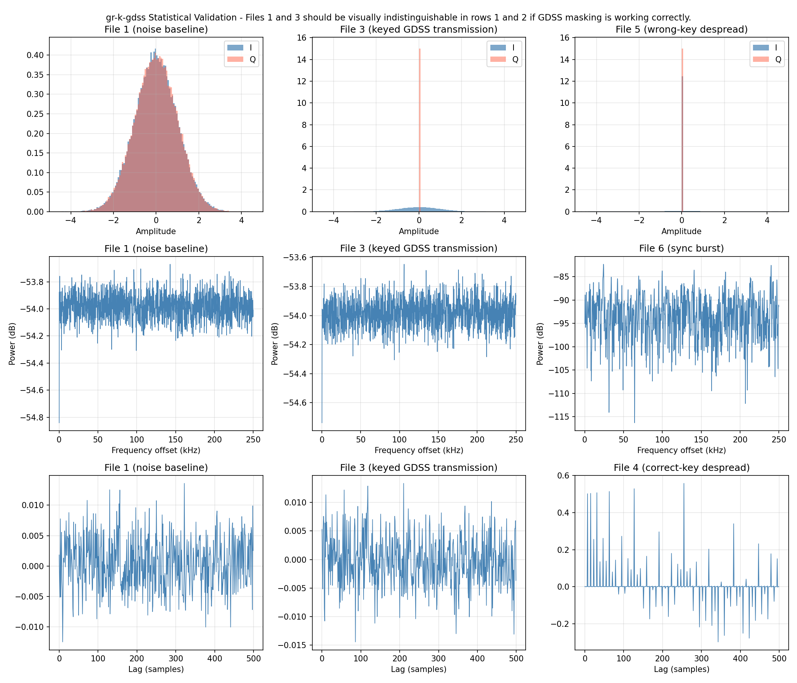

2. **iq_comparison_vs_standard.png** (4x3) — Keyed vs standard GDSS comparison. Rows 1–2: histograms and PSD for noise (01), keyed (03), and standard (09); all three should look alike. Row 3: cross-correlation of standard GDSS sessions (12, red) vs keyed sessions (13, green) and overlay; standard shows a detectable peak, keyed does not. The keyed correlation uses the full scheduled multi-burst session waveforms (11a vs 11b). Row 4: despreading (keyed correct/wrong key vs despread of standard GDSS without key).

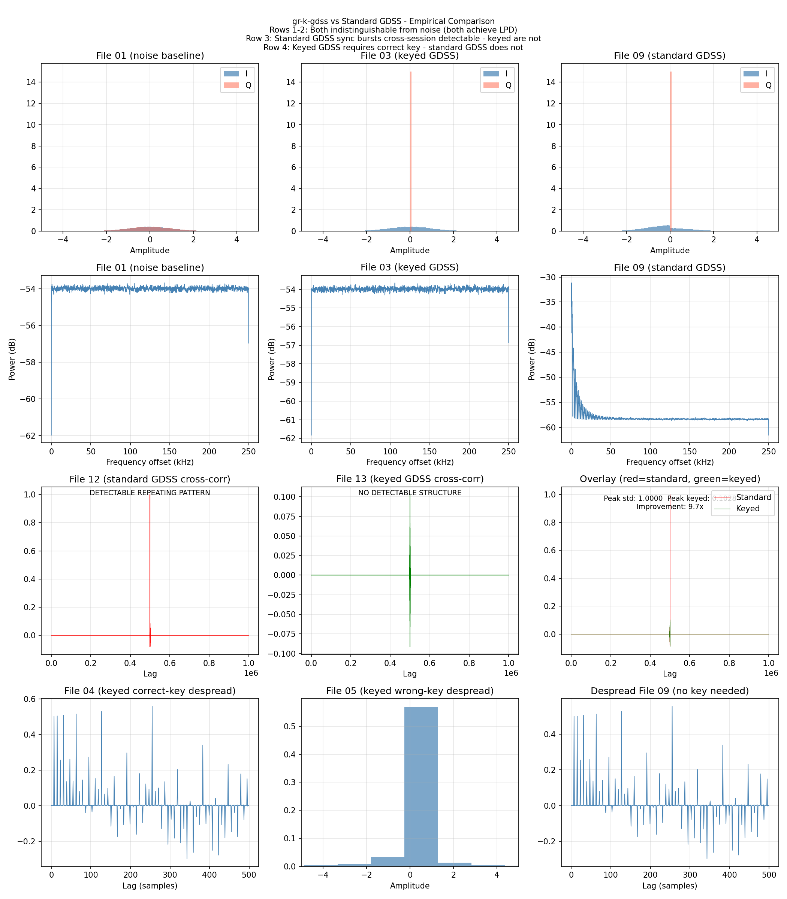

### Spectrum snapshot plots

Run `python3 tests/plot_spectrum_snapshots.py` to generate 600 kHz bandwidth spectrum images (Welch PSD with Gaussian roll-off for synthetic files; Blackman-Harris single-FFT for real noise). All images are written to `tests/iq_files/`.

| Image | Description |
|-------|-------------|
| **spectrum_baseline.png** | Gaussian noise baseline (File 01). |
| **spectrum_realistic_baseline.png** | Synthetic realistic baseline (File 01b): tilt, wandering, roll-off, 1/f, bumps. |
| **spectrum_standard_gdss.png** | Unkeyed GDSS with embedded sync pulse (File 09 + File 06). |
| **spectrum_keyed_gdss.png** | Keyed GDSS transmission (File 03). |
| **spectrum_real_noise.png** | Real recorded noise (File 08 from `tests/iq_files/` or `sdr-noise/`). Blackman-Harris window; generated only when File 08 exists. |
| **spectrum_realistic_plus_standard_gdss.png** | Realistic noise (01b) + unkeyed GDSS (09), Gaussian roll-off. Data: 01c. |
| **spectrum_realistic_plus_keyed_gdss.png** | Realistic noise (01b) + keyed GDSS (03), Gaussian roll-off. Data: 01d. |

#### Real recorded noise (File 08): interpretation

The updated real recorded noise spectrum is very informative. The Y-axis scale is extremely compressed (e.g. about -119.0 to -120.0 dB), only about a 1 dB range. That tells us:

- **Noise floor:** The noise floor is incredibly flat and consistent — only about 1 dB of variation across the entire 600 kHz bandwidth.
- **Two spikes near 0 Hz:** The plot shows two spikes close to 0 Hz rather than a single central spike. These are likely **IQ imbalance** from the hardware: LO (local oscillator) leakage appearing as a mirror image on both sides of 0 Hz, a classic sign of IQ mismatch in the SDR front end.
- **Broad hump around 0 Hz:** The broad hump around 0 Hz is **phase noise** from the local oscillator.

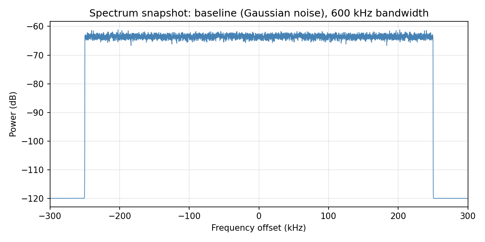

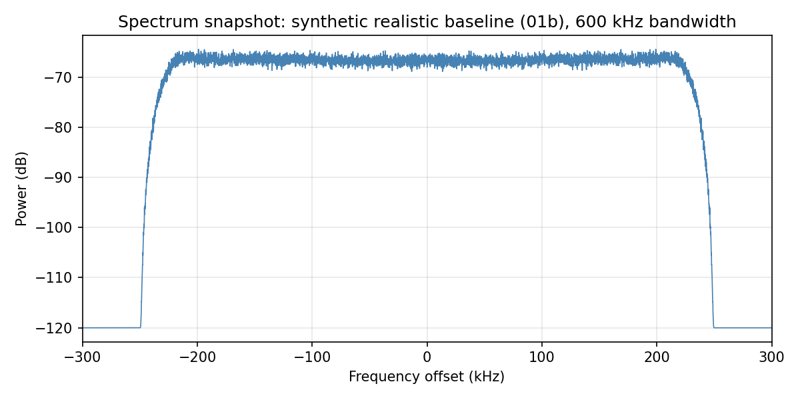

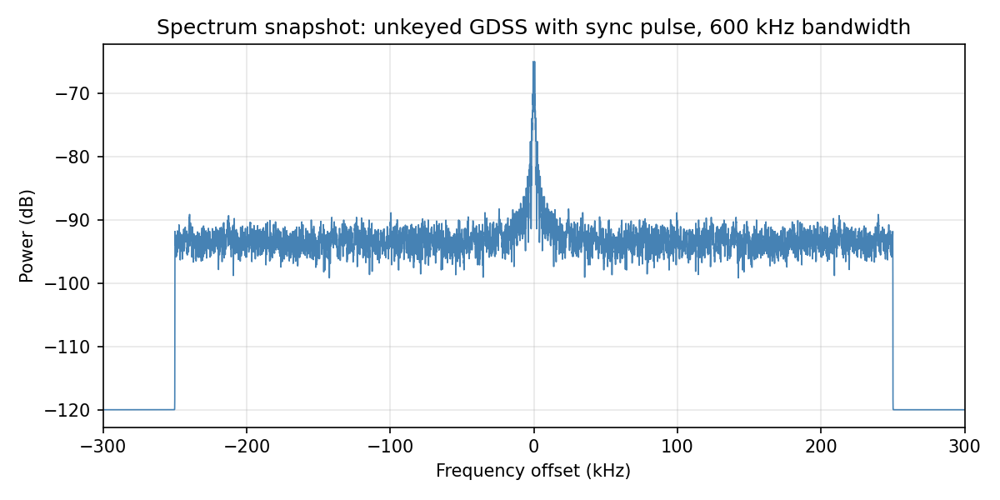

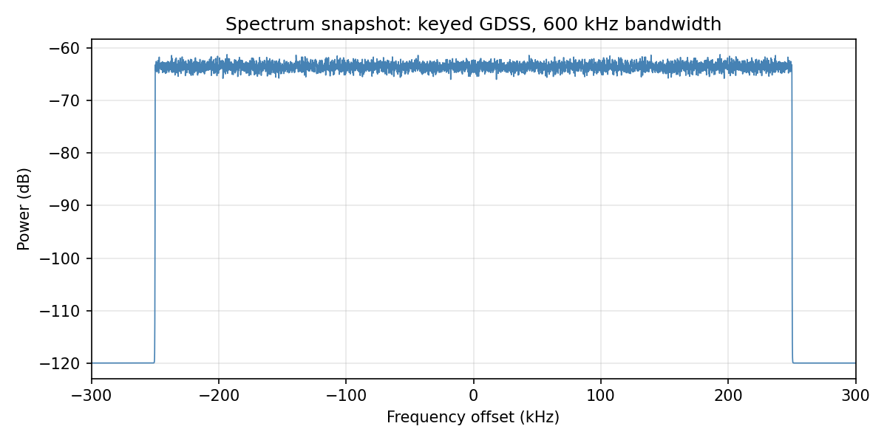

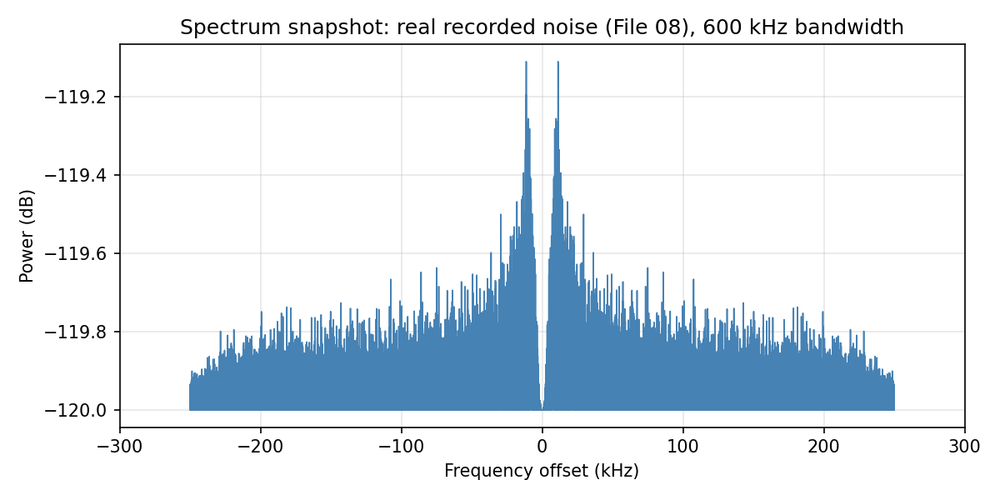

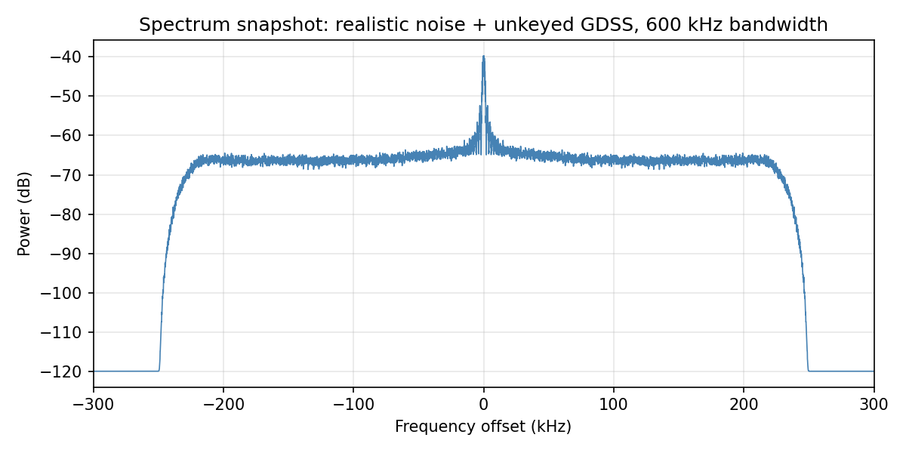

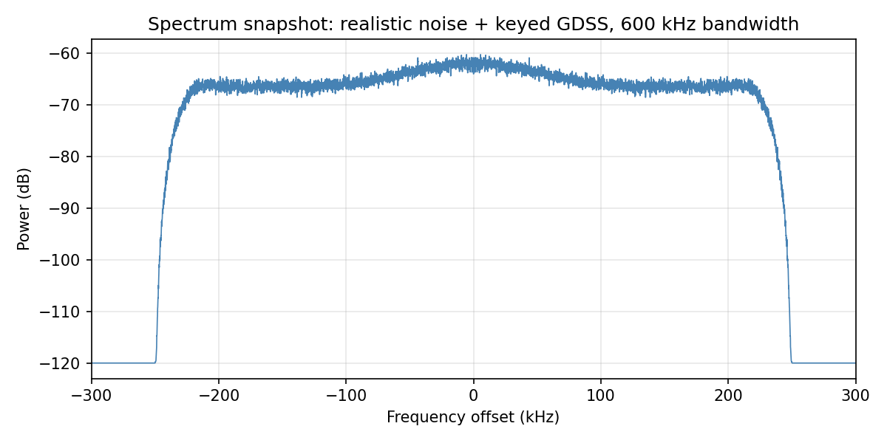

---

## Preprint BER and ITU/STANAG-style channel figures

These plots are **not** part of the pytest or IQ analysis pipeline. They are **NumPy/SciPy Monte Carlo** outputs used in the KGDSS preprint ([`paper/kgdss_paper.tex`](../paper/kgdss_paper.tex), Section 7). Models are simplified statistical channels (not GNU Radio hardware runs): AWGN chip combining, **ITU-R P.1406-inspired** VHF land-mobile (flat block Rayleigh; Doppler as noise scaling), **STANAG 4539-inspired** HF tapped-delay-line profiles, and ideal LDPC SNR shifts. Full methodology and build order: [`paper/README.md`](../paper/README.md).

**Source scripts:** [`paper/ber_simulation.py`](../paper/ber_simulation.py) writes `paper/figures/ber_mc_results.npz`; [`paper/gen_figures.py`](../paper/gen_figures.py) renders PNGs. Override `BER_MC_NUM_BITS` for faster dry runs (default `10^6` bits per SNR point per curve for publication-style smoothness). Most curves use **-20 dB to +25 dB** $E_b/N_0$; **VHF (Fig. 8)** uses **`snr_db_vhf`**: **-20 dB to +40 dB** so BER is not compressed only in the 0.2--0.5 region. **VHF:** flat block Rayleigh per symbol; Doppler (50 Hz / 200 Hz) is a noise-scaling proxy, not per-chip phase on the keyed `mean(r/m)` path. Captions note that a steep waterfall may still lie beyond the plotted range under Rayleigh + keyed masking. **Fig. 10:** keyed uncoded AWGN uses the +25 dB grid; LDPC overlays use an ideal SNR shift with log-BER extrapolation past the grid when needed.

| File | Role |
|------|------|
| `paper/figures/fig7_awgn_ber.png` | AWGN: DSSS (Shakeel eq.1) vs Monte Carlo standard and keyed GDSS, N = 64, 128, 256 |
| `paper/figures/fig8_vhf_ber.png` | VHF-style flat block Rayleigh; Doppler labels as noise scaling; SOQPSK Mode 1 vs 2; N = 256; uncoded and LDPC-shifted keyed GDSS; $E_b/N_0$ to +40 dB (`snr_db_vhf`) |
| `paper/figures/fig9_hf_ber.png` | HF-style AWGN / Good / Poor / Disturbed taps; N = 256; uncoded standard GDSS vs LDPC-coded keyed GDSS |
| `paper/figures/fig10_ldpc.png` | Keyed AWGN N = 256: uncoded MC to +25 dB; ideal rate-1/2 LDPC (576 vs 1152 bit block gain anchors); mask division limits slope vs standard GDSS |

**GitHub (main branch) direct links to PNGs:**

- [fig7_awgn_ber.png](https://github.com/Supermagnum/GR-K-GDSS/blob/main/paper/figures/fig7_awgn_ber.png)
- [fig8_vhf_ber.png](https://github.com/Supermagnum/GR-K-GDSS/blob/main/paper/figures/fig8_vhf_ber.png)
- [fig9_hf_ber.png](https://github.com/Supermagnum/GR-K-GDSS/blob/main/paper/figures/fig9_hf_ber.png)
- [fig10_ldpc.png](https://github.com/Supermagnum/GR-K-GDSS/blob/main/paper/figures/fig10_ldpc.png)

### Figure 7 (AWGN BER)

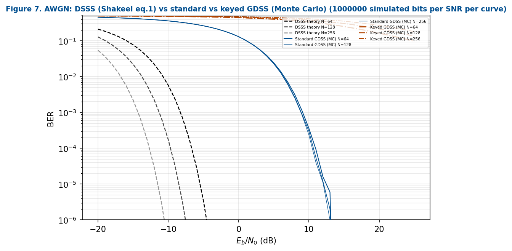

### Figure 8 (VHF land mobile, ITU-inspired)

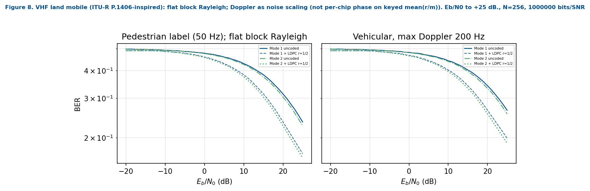

### Figure 9 (HF STANAG-inspired)

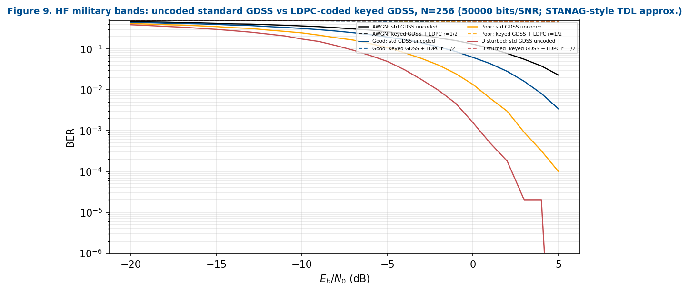

### Figure 10 (LDPC coding gain)

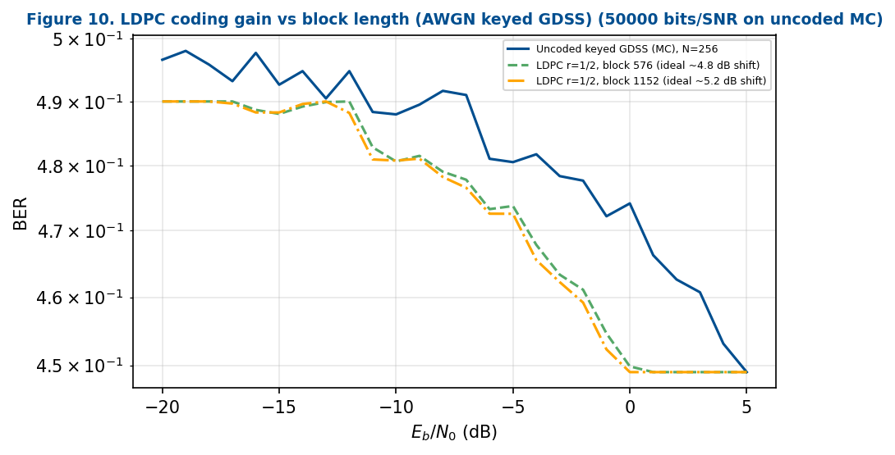
